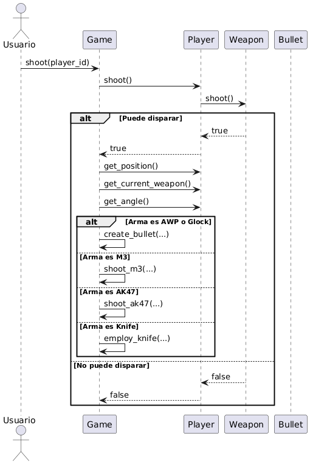
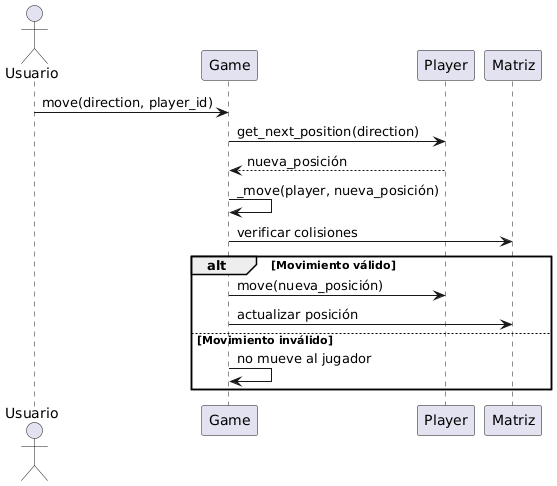
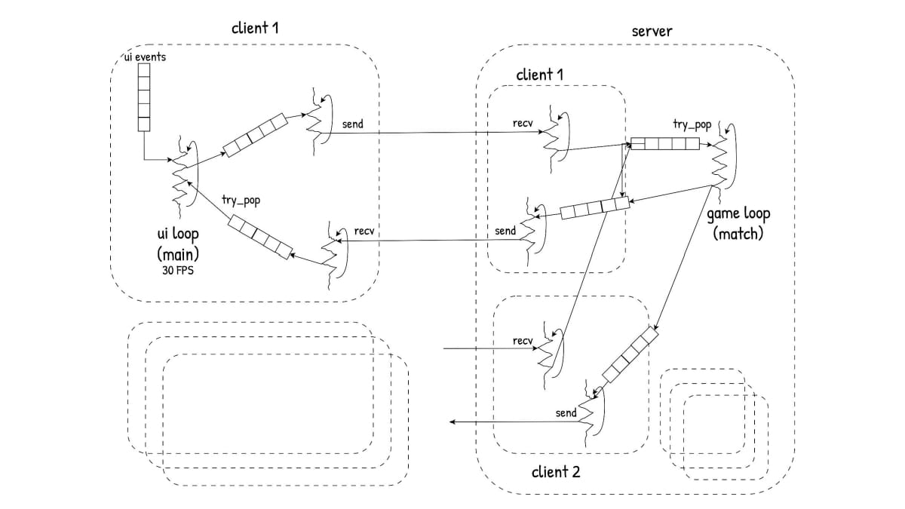
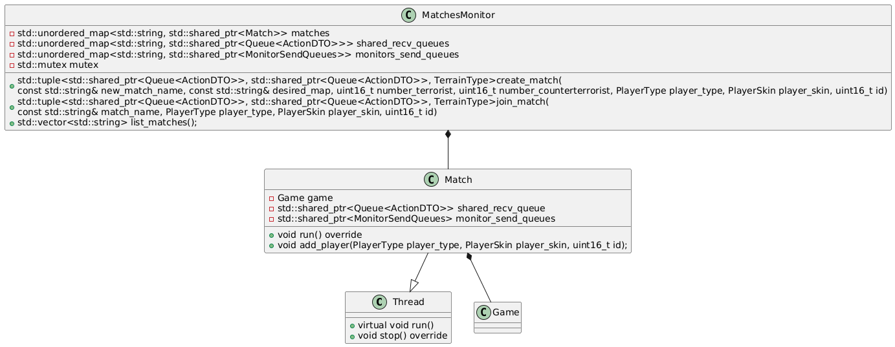

# Documentación técnica

<!-- La documentación técnica debe contener la información necesaria para que otro desarrollador puede entender la arquitectura e incluso continuar con el desarrollo del proyecto.

explicar con diagramas de clase y/o de secuencia las partes más importantes del proyecto. Resaltar los métodos mas importantes pero no es necesario diagramas detallistas: piensen que la documentación está para explicarle a otro desarrollador como funciona el proyecto.

explicar como es el formato de los archivos y del protocolo de comunicación.

Los diagramas deben graficar cómo esta constituido y/o resuelto el trabajo:

diagramas de clase de solo las clases mas importantes
diagramas de secuencia u objetos de las comunicaciones mas importante entre threads
Por ejemplo no tiene mucho sentido un diagrama completo de treinta clases o un diagrama tan genérico que podría ser el diagrama de cualquier trabajo.

En cambio aporta información un gráfico que centra la atención en una clase de alta importancia y aquellas relacionadas con la primera.

Usen un generador como PlantUML que son basados en texto en vez de uno gráfico para generar los diagramas rápidamente. -->

La presente documentación técnica tiene como objetivo describir la implementación de la lógica y la arquitectura del proyecto.

> **Nota:** Los gráficos y diagramas presentados en esta documentación han sido simplificados intencionalmente para mejorar la facilidad de lectura y comprensión. No incluyen todos los detalles de implementación, sino que buscan resaltar los aspectos más relevantes de la arquitectura y la lógica del sistema.

## Lógica (Clase `Game`)
El siguiente diagrama ilustra las clases principales relacionadas a la lógica del juego.

### Propósito General

La clase `Game` es el núcleo de la lógica y el estado de la partida. Se encarga de coordinar y administrar todos los elementos del juego: jugadores, armas, balas, bomba, obstáculos, estadísticas, fases de ronda y condiciones de victoria. 

Es a través de esta clase que el jugador puede realizar diversas tareas: sea la compra de armas y/o munición en la fase de tienda, o para moverse, disparar y/o levantar un arma del suelo. Esta clase se inicializa con un `Config` y un `Map`. Mientras que la primera tiene información sobre la partida, como la cantidad de rounds y jugadores por equipo, la segunda contiene información sobre el mapa, como las zonas de bomba y armas "en el piso". Esta última puede ser configurada desde la aplicación del Editor, también proporcionada en la entrega. Tanto `Config` como `Map` usan archivos .yaml para cargar las correspondientes configuraciones. 

Para simplificar el envío de datos entre el cliente y el servidor, está la clase `Object`. Esta resume la información más importante necesaria para que el cliente grafique el juego de manera acorde. De esta derivan las clases `Player`, con sus respectivas `Weapon` y `Knife`, al igual que `Obstacle`, `Bullet`, `BombZone`, y `Bomb`. 

### Responsabilidades Principales

- **Gestión de Jugadores:**  
  Administra la creación, posicionamiento, movimiento, rotación, cambio de arma, compra de armas y munición, recogida y caída de armas, y eliminación de jugadores. Controla también la aplicación de "_cheats_" y la actualización de estadísticas individuales.

- **Gestión de Objetos del Juego:**  
  Supervisa la creación, actualización y eliminación de todos los objetos activos en el juego, incluyendo armas, balas, la bomba, obstáculos y zonas especiales del mapa.

- **Lógica de Rondas y Fases:**  
  Controla el flujo de la partida, incluyendo el inicio y fin de rondas, la asignación de la bomba, el reinicio de jugadores y objetos, el cambio de roles de los equipos y la actualización de estadísticas de ronda y partida.

- **Colisiones y Movimiento:**  
  Implementa la detección de colisiones entre jugadores, balas, obstáculos y armas, utilizando algoritmos eficientes de colisión círculo-círculo y círculo-rectángulo. Calcula la máxima posición alcanzable por un objeto sin colisionar y actualiza la matriz espacial del mapa.

- **Gestión de la Bomba:**  
  Administra la lógica de plantado, cuenta regresiva, explosión y desactivación de la bomba, así como la verificación de condiciones de victoria relacionadas con la bomba.

- **Estadísticas y Condiciones de Victoria:**  
  Lleva el registro de muertes, bajas, dinero, rondas ganadas y determina el equipo ganador de cada ronda y de la partida completa.

- **Inicialización y Configuración:**  
  Carga obstáculos, zonas de bomba y armas iniciales desde la configuración del mapa y posiciona a los jugadores en ubicaciones válidas según su equipo.

### Diagramas de Secuencia: Disparo (`Game::shoot`)

**Descripción:**  
El siguiente diagrama de secuencia muestra el proceso completo cuando un jugador realiza un disparo. El usuario solicita disparar, el objeto `Game` delega la acción al `Player`, quien consulta a su `Weapon` si puede disparar (verificando munición y cooldown). Si el disparo es válido, se crea una nueva bala y se actualizan los objetos del juego según el tipo de arma.

### Diagramas de Secuencia: Movimiento (`Game::move`)

**Descripción:**  
Este diagrama de secuencia ilustra cómo se gestiona el movimiento de un jugador. El usuario solicita moverse en una dirección; `Game` calcula la nueva posición, verifica posibles colisiones y, si el movimiento es válido, actualiza la posición del jugador y la matriz espacial del mapa.

### Consideraciones de Diseño

- **Modularidad:** La clase delega la lógica específica de armas, balas y jugadores a sus respectivas clases, manteniendo la lógica de alto nivel.
- **Extensibilidad:** Permite agregar nuevas armas, tipos de objetos y reglas de juego con cambios mínimos.
- **Configurabilidad:** Utiliza archivos de configuración para definir parámetros de armas, rondas y mapa.

### Resumen

La clase `Game` es el controlador principal de la lógica del juego, coordinando la interacción entre jugadores, armas, balas, bomba y el entorno. Su diseño modular y configurable facilita la extensión y el mantenimiento del código, permitiendo implementar nuevas mecánicas y reglas de juego de manera eficiente.

## Arquitectura Cliente-Servidor

Los siguientes diagramas de clases ofrecen una visión general de la estructura de comunicación en la arquitectura cliente-servidor.

Además, el siguiente diagrama ilustra la interacción entre la arquitectura cliente-servidor y la lógica del juego.

Por un lado, el _Server_ cuenta con un hilo principal que espera de forma bloqueante la entrada del carácter `QUIT_CHARACTER` por la entrada estándar para finalizar su ejecución. Paralelamente, el hilo _Acceptor_ se encarga de aceptar nuevas conexiones de forma continua, generando un nuevo hilo _ClientHandler_ por cada cliente que se conecta.

Cada _ClientHandler_ comienza con un intercambio de mensajes con el cliente para definir su ingreso a una partida, coordinado mediante el **MatchesMonitor**. Este monitor gestiona la creación de nuevas partidas a través de hilos _Match_ o la asignación de jugadores a partidas existentes. Una vez completado este intercambio, el _ClientHandler_ lanza dos nuevos hilos: _ServerReceiver_ y _ServerSender_, responsables de recibir y enviar mensajes entre el cliente y la partida, a través del **ServerProtocol** (el cual utiliza el respectivo **Socket**) y comunicándose con las **Queues** correspondientes (una de recepción compartida por todos los jugadores de la partida, y otra de envío individual por cliente).

A su vez, cada _Match_ se encarga de ejecutar la lógica de la partida, actualizar el estado del juego y enviar snapshots a los jugadores involucrados.

Por otro lado, el _Client_, tras establecer la conexión inicial con el _Server_, también crea dos hilos: _ClientReceiver_ y _ClientSender_. Estos hilos manejan el envío y la recepción de mensajes al servidor, a través del **ClientProtocol** (el cual utiliza el respectivo **Socket**) y comunicándose con las **Queues** correspondientes (una de recepción y una de envío).

### Protocolo

El siguiente diagrama de secuencia muestra la comunicación entre el cliente y el servidor.

Al inicio se lleva a cabo un _handshake_: el servidor envía a cada cliente que se conecta la lista de mapas y partidas disponibles. Posteriormente, el cliente responde con sus preferencias, y el servidor le proporciona el tipo de terreno (según el mapa elegido) junto con el identificador del jugador.

Tras esta negociación, el cliente entra en un estado de espera en el _waiting-lobby_. La espera finaliza cuando el cliente así lo decida o cuando se haya alcanzado el número requerido de jugadores.

A continuación, da comienzo la partida. Cada ronda consta de tres fases:

- La _fase de tienda_, en la cual el servidor envía el catálogo de armas y el cliente puede realizar sus compras.
- La _fase de juego_, en la cual el cliente envía sus acciones, mientras que el servidor actualiza el estado interno de la partida en consecuencia y envía de forma constante _snapshots_ hacia el cliente.
- La _fase de estadísticas_, en la cual el servidor envía las estadísticas de los jugadores una vez finalizada la ronda.

Al finalizar la partida, se envía un mensaje con el equipo ganador, seguido de un mensaje de finalización, dando cierre a la sesión.