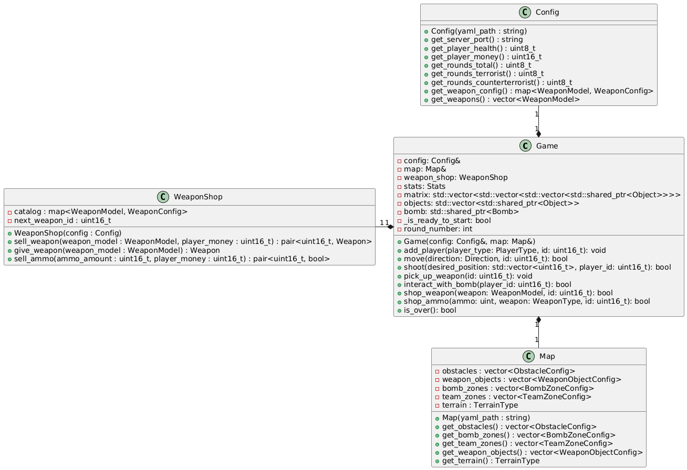
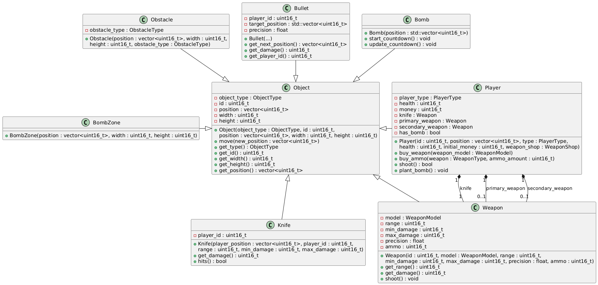
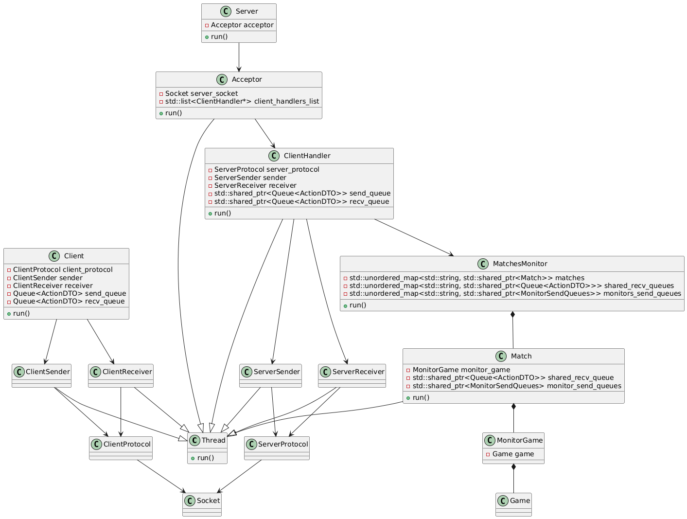
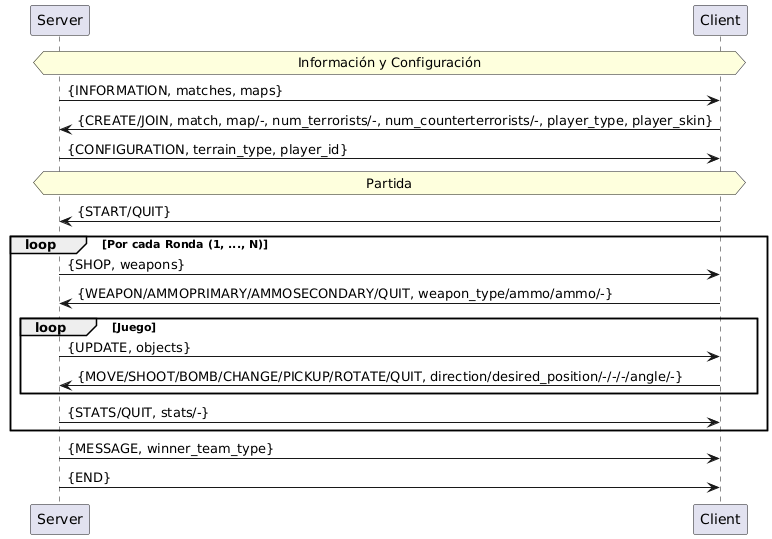

# Documentación técnica

<!-- La documentación técnica debe contener la información necesaria para que otro desarrollador puede entender la arquitectura e incluso continuar con el desarrollo del proyecto.

explicar con diagramas de clase y/o de secuencia las partes más importantes del proyecto. Resaltar los métodos mas importantes pero no es necesario diagramas detallistas: piensen que la documentación está para explicarle a otro desarrollador como funciona el proyecto.

explicar como es el formato de los archivos y del protocolo de comunicación.

Los diagramas deben graficar cómo esta constituido y/o resuelto el trabajo:

diagramas de clase de solo las clases mas importantes
diagramas de secuencia u objetos de las comunicaciones mas importante entre threads
Por ejemplo no tiene mucho sentido un diagrama completo de treinta clases o un diagrama tan genérico que podría ser el diagrama de cualquier trabajo.

En cambio aporta información un gráfico que centra la atención en una clase de alta importancia y aquellas relacionadas con la primera.

Usen un generador como PlantUML que son basados en texto en vez de uno gráfico para generar los diagramas rápidamente. -->

La presente documentación técnica tiene como objetivo describir la implementación de la lógica y la arquitectura del proyecto.

## Lógica
El siguiente diagrama ilustra las clases principales relacionadas a la lógica del juego.

La clase principal es _Game_. A través de esta es que el jugador se comunica para diversas tareas: sea la compra de armas y/o munición en la fase de tienda, o para moverse, disparar y/o levantar un arma del suelo. Esta clase se inicializa con un _Config_ y un _Map_. Mientras que la primera tiene información sobre la partida, como la cantidad de rounds y jugadores por equipo, la segunda contiene información sobre el mapa, como las zonas de bomba y armas "en el piso". Esta última puede ser configurada desde la aplicación del Editor, también proporcionada en la entrega.

Para simplificar el envío de datos entre el cliente y el servidor, está la clase _Object_. Esta resume la información más importante necesaria para que el cliente grafique el juego de manera acorde. De esta derivan las clases _Player_, con sus respectivas _Weapon_ y _Knife_, al igual que _Obstacle_, _Bullet_, _BombZone_, y _Bomb_. 

## Arquitectura Cliente-Servidor

El siguiente diagrama de clases proporciona una visión general de la estructura de la arquitectura cliente-servidor.

Por un lado, el _Server_, en su hilo principal, recibe de forma bloqueante por entrada estándar ingresos, si este ingreso es `QUIT_CHARACTER`, entonces detiene y joinea al hilo MatchManager. Por su parte el hilo _MatchManager_ se encarga de recibir y direccionar cada cliente aceptado a la partida correspondiente, creando un hilo ClientHandler por cada uno, y, cuando corresponde, un hilo Match por partida. _ClientHandler_ crea un hilo _ServerReceiver_ y un _ServerSender_, para manejar los respectivos mensajes, y comunicar la partida y el cliente con las respectivas _Queues_ y _Sockets_. Mientras tanto _Match_ se encarga de la partida en sí, las actualizaciones de estado y los envíos de snapshots correspondientes.

Por otro lado, el _Client_, en su hilo principal, crea un hilo _ServerReceiver_ y un _ServerSender_, para manejar los respectivos mensajes, y comunicar el server y el cliente con las respectivas _Queues_ y _Socket_.

### Protocolo

El siguiente diagrama de secuencia proporciona una visión general de la comunicación entre el cliente y el servidor.

Al inicio se lleva a cabo un _handshake_: el servidor envía a cada cliente que se conecta la lista de mapas y partidas disponibles. Posteriormente, el cliente responde con sus preferencias, y el servidor le proporciona el tipo de terreno (según el mapa elegido) junto con el identificador del jugador.

Tras esta negociación, el cliente entra en un estado de espera en el _pre-lobby_. La espera finaliza cuando el cliente así lo decida o cuando se haya alcanzado el número requerido de jugadores.

A continuación, da comienzo la partida. Cada ronda consta de tres fases:

- La _fase de tienda_, en la cual el servidor envía el catálogo de armas y el cliente puede realizar sus compras.
- La _fase de juego_, en la cual el cliente envía sus acciones, mientras que el servidor actualiza el estado interno de la partida en consecuencia y envía de forma constante _snapshots_ hacia el cliente.
- La _fase de estadísticas_, en la cual el servidor envía las estadísticas de los jugadores una vez finalizada la ronda.

Finalmente, cuando concluye la partida, se envía un mensaje de fin y se da por terminada la sesión.
