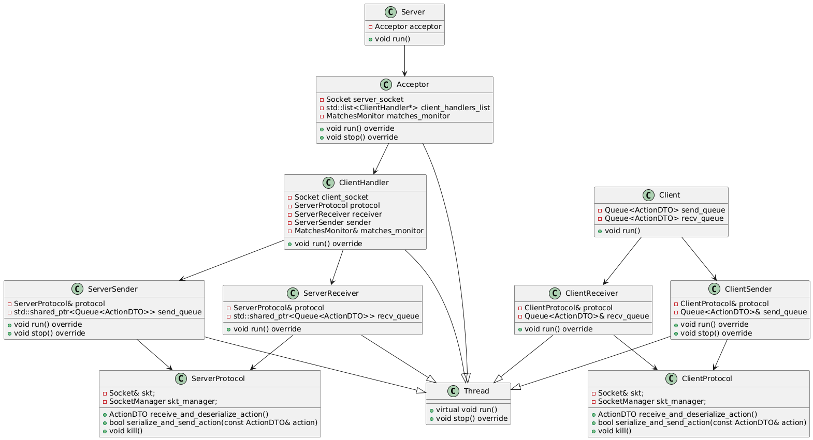

# Documentación técnica

<!-- La documentación técnica debe contener la información necesaria para que otro desarrollador puede entender la arquitectura e incluso continuar con el desarrollo del proyecto.

explicar con diagramas de clase y/o de secuencia las partes más importantes del proyecto. Resaltar los métodos mas importantes pero no es necesario diagramas detallistas: piensen que la documentación está para explicarle a otro desarrollador como funciona el proyecto.

explicar como es el formato de los archivos y del protocolo de comunicación.

Los diagramas deben graficar cómo esta constituido y/o resuelto el trabajo:

diagramas de clase de solo las clases mas importantes
diagramas de secuencia u objetos de las comunicaciones mas importante entre threads
Por ejemplo no tiene mucho sentido un diagrama completo de treinta clases o un diagrama tan genérico que podría ser el diagrama de cualquier trabajo.

En cambio aporta información un gráfico que centra la atención en una clase de alta importancia y aquellas relacionadas con la primera.

Usen un generador como PlantUML que son basados en texto en vez de uno gráfico para generar los diagramas rápidamente. -->

La presente documentación técnica tiene como objetivo describir la implementación de la lógica y la arquitectura del proyecto.

## Lógica
El siguiente diagrama ilustra las clases principales relacionadas a la lógica del juego.

La clase principal es _Game_. Es a través de esta que el jugador se comunica para realizar diversas tareas: sea la compra de armas y/o munición en la fase de tienda, o para moverse, disparar y/o levantar un arma del suelo. Esta clase se inicializa con un _Config_ y un _Map_. Mientras que la primera tiene información sobre la partida, como la cantidad de rounds y jugadores por equipo, la segunda contiene información sobre el mapa, como las zonas de bomba y armas "en el piso". Esta última puede ser configurada desde la aplicación del Editor, también proporcionada en la entrega. Tanto _Config_ como _Map_ usan archivos .yaml para cargar las correspondientes configuraciones. 

Para simplificar el envío de datos entre el cliente y el servidor, está la clase _Object_. Esta resume la información más importante necesaria para que el cliente grafique el juego de manera acorde. De esta derivan las clases _Player_, con sus respectivas _Weapon_ y _Knife_, al igual que _Obstacle_, _Bullet_, _BombZone_, y _Bomb_. 

## Arquitectura Cliente-Servidor

El siguiente diagrama de clases proporciona una visión general de la estructura de clases de la arquitectura cliente-servidor.

Además, el siguiente diagrama ofrece una visión general de la estructura de comunicación en la arquitectura cliente-servidor.

Por un lado, el _Server_ cuenta con un hilo principal que espera de forma bloqueante la entrada del carácter `QUIT_CHARACTER` por la entrada estándar para finalizar su ejecución. Paralelamente, el hilo _Acceptor_ se encarga de aceptar nuevas conexiones de forma continua, generando un nuevo hilo _ClientHandler_ por cada cliente que se conecta.

Cada _ClientHandler_ comienza con un intercambio de mensajes con el cliente para definir su ingreso a una partida, coordinado mediante el **MatchesMonitor**. Este monitor administra la creación de nuevas partidas a través de hilos _Match_ o la asignación de jugadores a partidas ya existentes. Una vez completado este intercambio, el _ClientHandler_ lanza dos nuevos hilos: _ServerReceiver_ y _ServerSender_, responsables de recibir y enviar mensajes entre el cliente y la partida, a través del **ServerProtocol** (el cual utiliza su respectivo **Socket**) y comunicándose con las **Queues** correspondientes.

A su vez, cada _Match_ se encarga de ejecutar la lógica de la partida, actualizar el estado del juego y enviar snapshots a los jugadores involucrados.

Por otro lado, el _Client_, tras establecer la conexión inicial con el _Server_, también crea dos hilos: _ClientReceiver_ y _ClientSender_. Estos hilos manejan el envío y la recepción de mensajes al servidor, a través del **ClientProtocol** (el cual utiliza su respectivo **Socket**) y comunicándose con las **Queues** correspondientes.

### Protocolo

El siguiente diagrama de secuencia proporciona una visión general de la comunicación entre el cliente y el servidor.

Al inicio se lleva a cabo un _handshake_: el servidor envía a cada cliente que se conecta la lista de mapas y partidas disponibles. Posteriormente, el cliente responde con sus preferencias, y el servidor le proporciona el tipo de terreno (según el mapa elegido) junto con el identificador del jugador.

Tras esta negociación, el cliente entra en un estado de espera en el _waiting-lobby_. La espera finaliza cuando el cliente así lo decida o cuando se haya alcanzado el número requerido de jugadores.

A continuación, da comienzo la partida. Cada ronda consta de tres fases:

- La _fase de tienda_, en la cual el servidor envía el catálogo de armas y el cliente puede realizar sus compras.
- La _fase de juego_, en la cual el cliente envía sus acciones, mientras que el servidor actualiza el estado interno de la partida en consecuencia y envía de forma constante _snapshots_ hacia el cliente.
- La _fase de estadísticas_, en la cual el servidor envía las estadísticas de los jugadores una vez finalizada la ronda.

Finalmente, cuando concluye la partida, se envía un mensaje de fin y se da por terminada la sesión.
