# Manual de usuario

### Conexión al servidor
Para comenzar el juego es necesario conectarse al servidor. Para esto el usuario debe ingresar la dirección IP y el puerto que está escuchando. 

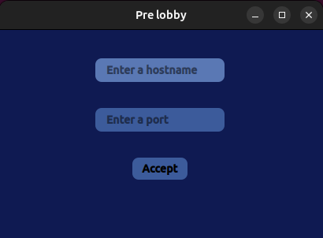

### Lobby
Una vez conectado al servidor, el usuario podrá elegir crear una partida o unirse a una.

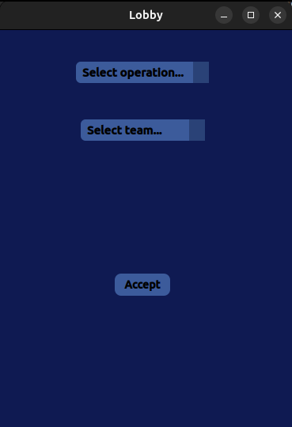

**Crear Partida:**
En caso de seleccionar la opción de _Create match_, se debe seleccionar un mapa, ingresar el nombre de la partida y la cantidad de jugadores que habrá en cada equipo. A su vez, se debe seleccionar a cual equipo se quiere pertenecer y la respectiva skin. 

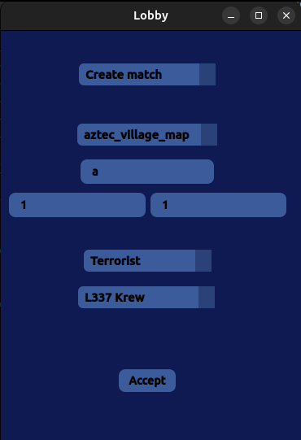

**Unirse a partida:**
En caso de seleccionar la opción de _Join match_, se debe seleccionar la partida a la cual unirse, el equipo y la skin.

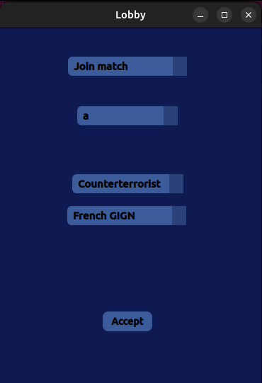

### Inicio partida
* Una vez que se ingresan los respectivos datos, se pasa a la sala de espera hasta que esten todos los participantes. 

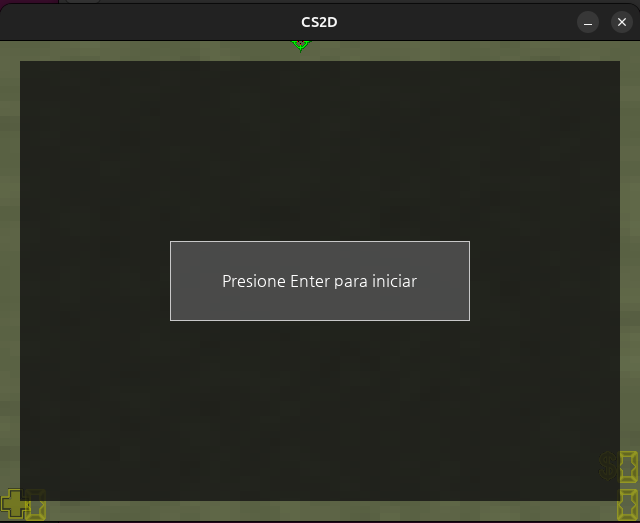

* Luego de esto, el usuario se encuentra con la sección _shop_, en la cual puede adquirir armas. Para esto, se debe presionar la tecla con el número correspondiente al arma deseada. 

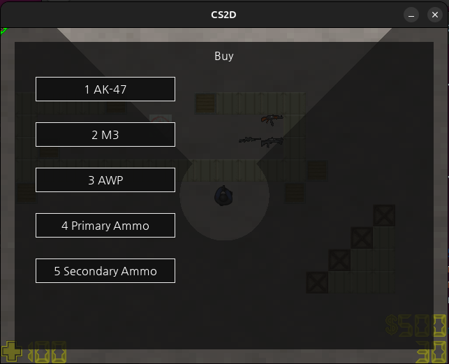

* Finalmente se ingresa a la partida, y se tiene una vista similar a la siguiente.

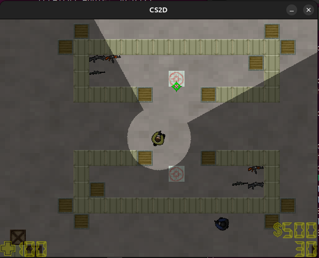

### Juego
El juego consiste en una batalla armada entre 2 bandos. Los `terroristas` tienen como objetivo plantar una bomba para ganar la partida, mientras que los `anti-terroristas` deben impedirlo. 

Una partida consta de `10 rondas`. Cada una de estas rondas, puede finalizar por 3 razones: 
* Todos los integrantes de un bando han sido eliminados.
* Los terroristas logran plantar la bomba y ésta explota. 
* Los anti-terroristas logran desactivar la bomba antes de que explote. 
(Si los terroristas plantan la bomba, pero son eliminados, de igual forma pueden ganar la ronda si es que se logra desactivar la bomba a tiempo.)

**Armas** 
El juego dispone de 6 armas: 
* _Bomba:_ arma exclusiva de los terroristas, y sólo se cuenta con una por partida. En caso de morir el jugador que la posee otro integrante puede tomarla. Este elemento sólo puede ser activado en las zonas indicadas en el mapa, al presionar la tecla `b`. Este comando sirve también para desactivarla. 

* _Cuchillo:_ al quedarse sin armas es lo único que le queda al jugador. Para realizar el ataque el jugador debe estar al lado del enemigo y debe hacer `click izquierdo`.

* _Glock:_ solo puede disparar de a una bala cada vez que el jugador presione el `click izquierdo`. Genera un daño mayor que el cuchillo a una distancia adecuada.

* _AK-47:_ dispara de a 3 balas por rafaga al presionado el `click izquierdo`. El daño de las balas impactadas es menor que la pistola.

* _M3:_ hace daño en área en forma de cono. Tiene una distancia de alcance menor a las anteriores. Al igual que las demás armas, se dispara al hacer `click izquierdo`. Su daño es muy grande si el disparo se realiza a corta distancia del objetivo.

* _AWP:_ es el arma con el mayor alcance. Su disparo, cuando acierta causa el máximo impacto. Su daño no se ve afectado por la distancia del objetivo. Para disparar debe hacerse `click izquierdo`.

Información extra:
* El cuchillo, la pistola (y la bomba para los terroristas) vienen en el equipo default de cada jugador al empezar la partida. Las demás pueden ser compradas en el shop al inicio de cada partida. 

* Al terminar la ronda, el jugador conservará sus armas y balas. Sin embargo, si el jugador es asesinado en una ronda, pierde todas sus armas y los demás pueden tomarlas presionando la tecla `r`, al estar posicionados sobre dicha arma. 

* El jugador puede tener hasta 3 armas: el cuchillo y la pistola (arma secundaria) que vienen por default, y una
de las otras tres alternativas (arma principal). En el caso de los terroristas, a aquel que le toque la bomba, cuenta con 4 armas. Estas podrán ser intercambiadas durante el juego al presionar el `espacio`. El arma optativa puede ser cambiada por
otra en la tienda, o tomando una que haya perdido otro jugador, desequipandosé el arma optativa que tenga (si es que posee una).

**Personajes**
Como ya se mecionó, el juego consta de 2 equipos, los *terroristas* y los *counterterroristas*. Los jugadores de acuerdo a que bando pertenezcan tendrán 4 opciones de _skin_ para elegir al inicio de la partida. Todos los personajes cuentan con una vida inicial, que irá disminuyendo a medida que vayan recibiendo impactos. 

Para moverse, se deben utilizar las teclas:
* `w`: hacia arriba.
* `a`: hacia la izquierda.
* `s`: hacia abajo.
* `d`: hacia la derecha.

A su vez, el jugador puede apuntar la dirección con el mouse.  

Cada jugador cuenta con un saldo, que va aumentando en cada ronda con una suma inicial, y también cuenta con bonificaciones. Estas bonificaciones son obtenidas al ganar una ronda, o al matar a un rival. Este saldo puede usarse para obtener equipamiento. 

A continuación, al clickear sobre alguna de las imágenes, se puede ver una pequeña demostración de cómo funcionan todos estos features.

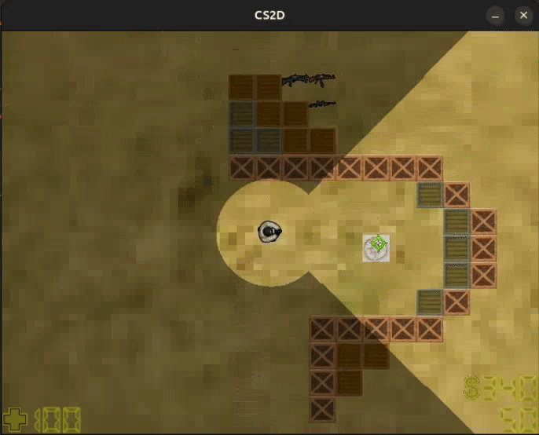
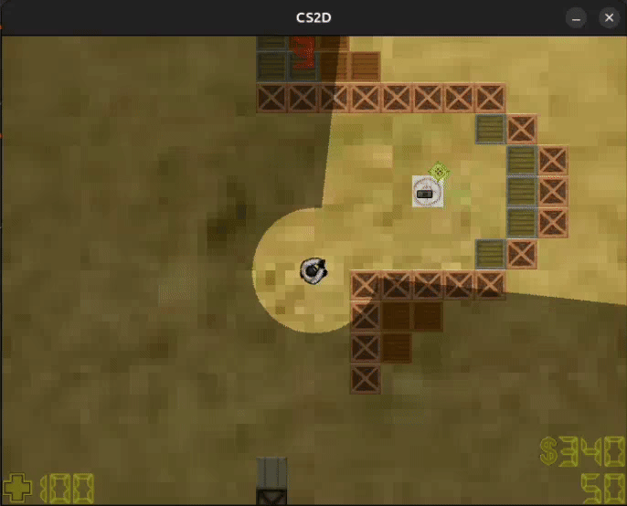
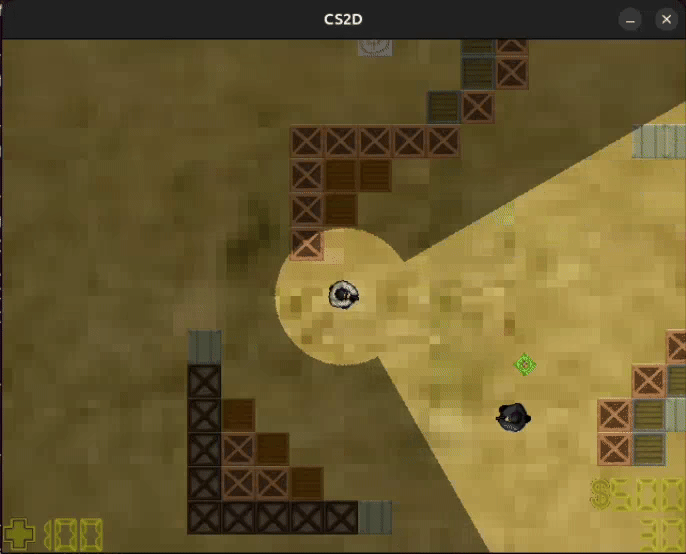

### Editor
Una vez iniciado el editor de mapas, se verá esta pantalla principal. El editor brinda la posibilidad de guardar un nuevo mapa, abrir uno ya creado o limpiar la zona de edición.

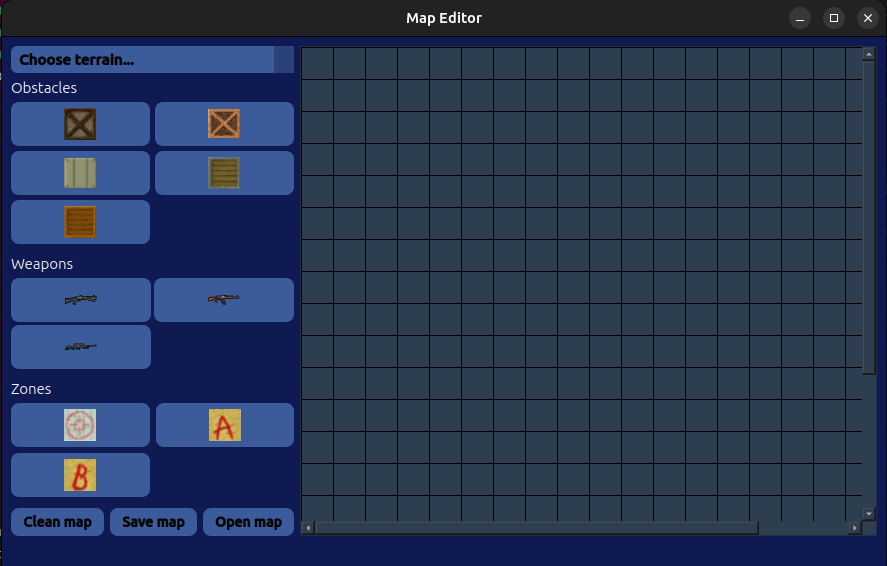

* Como primer paso se debe seleccionar el tipo de `terreno`. 
* Luego hay diversos tipos de `obstaculos` y `armas` para agregar. El editor cuenta con 2 formas de hacerlo: 

    + **Point and click:** click sobre el botón con el obstaculo/arma que se quiere agregar; y luego click en el mapa.
    + **Drag and drop:** se selecciona el obstaculo/arma haciendo click sobre el botón y en el mapa manteniendo el click apretado se arrastra.

* Se deben agregar `zonas de bombas`, y de `inicio de cada equipo`.

* El editor también cuenta con una opción de `borrar` un elemento particular. Esto se logra haciendo `click derecho` sobre el elemento que se quiere eliminar. 

Un ejemplo luego de seguir estos pasos es el siguiente:

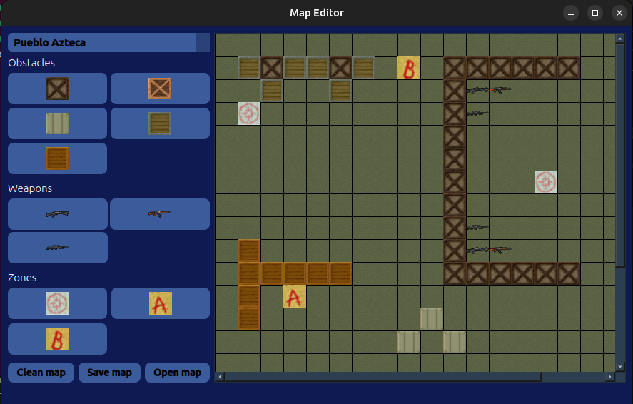

